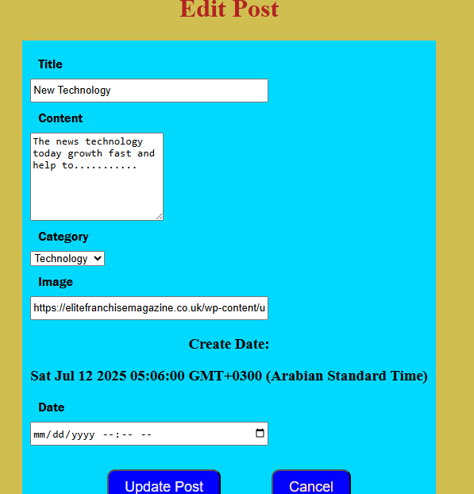
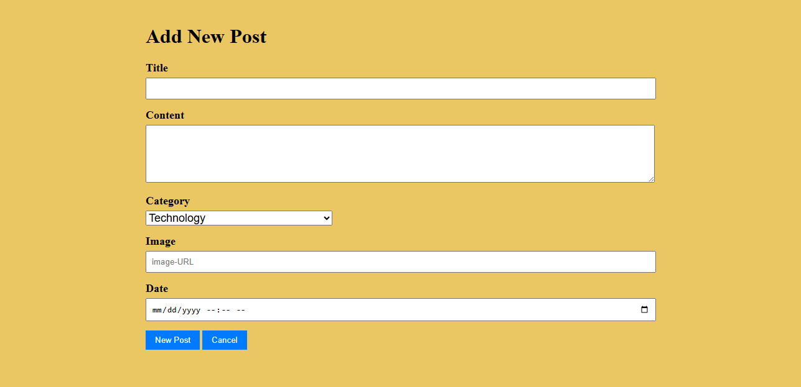
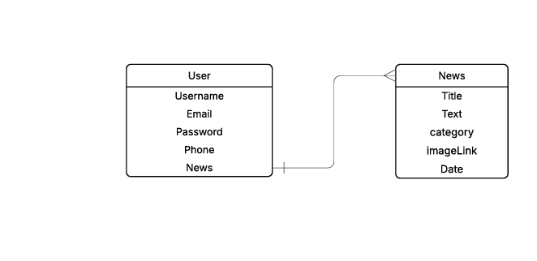

# News

This App Use to review and Add News Postes In the internet

1. User will Sing-up  and create new Account 

2. After Sign-up it will sign-in to allow user to Add new Postes 

* While the sign-in we will Validate input of User and catch any possiple error 

3. Gust option can review news without have any controll

4. Edit page 

5. Add new post form 

6. Trello and Plane for project matrial

Project planning link[Trello](https://trello.com/invite/b/6870ddac83b4fb4c4772e029/ATTIe0bee0f29393b3d94f6db2cc676749ba69C313C5/my-trello-board)

[Trello new](https://trello.com/invite/b/68727085a06603670ccce9d0/ATTI98baad7703c8ec0012ce4082f4c8f581110B3AC3/news-project)
7. ERD

8. Use for project
 This project Use HTML,CSS,JAVASCRIPT  and Use MongooDB as Database
